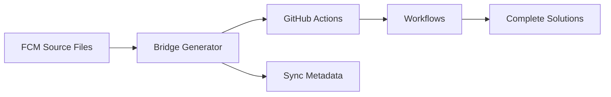

# Architecture Overview

> ⚠️ **Documentation Warning**: This page presents a high-level architectural vision that may not fully represent the current implementation. The concepts and diagrams require validation against the actual codebase. See [Documentation Gaps](../development/documentation-gaps.md).

The GitHub Toolkit appears to employ an approach to automation that treats some capability definitions as source code for generating GitHub Actions. This overview attempts to document the observed patterns.

## Core Innovation: FCM Bridge System

The toolkit's foundation is the **Functional Capability Model (FCM) Bridge System**, which transforms how we build and maintain automation:



**Traditional Approach**: Manually create and maintain GitHub Actions  
**Toolkit Approach**: Define capabilities in FCM files, generate actions automatically

## Six-Layer Architecture

The system organizes components into six distinct layers, each building upon the layer below:

```
┌─────────────────────────────────────┐
│     6. ECOSYSTEMS (Solutions)      │ ← Complete automation systems
├─────────────────────────────────────┤
│     5. ORGANISMS (Workflows)       │ ← GitHub workflow files
├─────────────────────────────────────┤  
│     4. MOLECULES (Composites)      │ ← Multi-action orchestration
├─────────────────────────────────────┤
│     3. ATOMS (Core Actions)        │ ← Generated GitHub Actions
├─────────────────────────────────────┤
│     2. PARTICLES (Utilities)       │ ← Shared code and patterns
├─────────────────────────────────────┤
│     1. AXIOMS (Capabilities)       │ ← FCM source definitions
└─────────────────────────────────────┘
```

## Key Architectural Principles

### 1. Source vs Generated Code
- **FCM files are source code** - edited by humans, version controlled
- **Actions are compiled artifacts** - never edited manually, always regenerated
- **Clear separation** prevents drift and ensures consistency

### 2. Naming Conventions as Visual Indicators
- **Hyphenated names** (`branch-operations`) = Generated from FCM
- **Underscore names** (`git_ops`) = Manually created
- **Dot prefixes** (`.flow.internal.yml`) = Private/repository-specific

### 3. Self-Describing System
- Every generated action includes `.bridge-sync` metadata
- System can validate its own consistency
- Traceability from action back to source FCM

### 4. Layered Responsibilities
- Each layer has specific, focused responsibilities  
- Lower layers are used by higher layers
- Changes propagate predictably through layers

## Practical Benefits

### For Users
- **Consistency**: All actions follow the same patterns
- **Reliability**: LCMCP pattern ensures robust Git operations
- **Discoverability**: Clear naming and organization
- **Documentation**: Self-documenting through FCM definitions

### For Maintainers
- **Scalability**: Add new capabilities without exponential complexity
- **Quality**: Generated code follows patterns automatically
- **Maintenance**: Update patterns once, apply everywhere
- **Validation**: Automated checks ensure system integrity

### For Contributors
- **Clear Guidelines**: Architecture provides contribution framework
- **Predictable Structure**: Know where everything belongs
- **Easy Extension**: Add capabilities at appropriate layer
- **Quality Assurance**: Built-in validation and testing

## Real-World Example

Consider a complete release automation:

1. **Axiom**: `git.tag-operations.fcm` defines tag management capability
2. **Atom**: Generated `tag-operations` action implements the capability  
3. **Molecule**: `release_operations` composite combines multiple atoms
4. **Organism**: `prepare-release.yml` workflow orchestrates the process
5. **Ecosystem**: Complete release management system for repositories

Each layer adds value while maintaining clear boundaries and responsibilities.

## Getting Started

1. **Understand the Concepts**: Read [Core Concepts](concepts/index.md)
2. **Learn the Patterns**: Study the [User Guide](guides/index.md)  
3. **Explore Implementation**: Check [Reference](actions/index.md) documentation
4. **Dive Deep**: Review detailed [Architecture](architecture/index.md) documentation

## Next Steps

- **[Core Concepts](concepts/index.md)** - Detailed understanding of key concepts
- **[User Guide](guides/index.md)** - Practical implementation guidance
- **[Architecture](architecture/index.md)** - Deep technical architecture details
- **[Development](development/index.md)** - Contributing to the system

The GitHub Toolkit's architecture represents a new paradigm in automation - one that scales, maintains quality, and evolves gracefully with changing requirements.