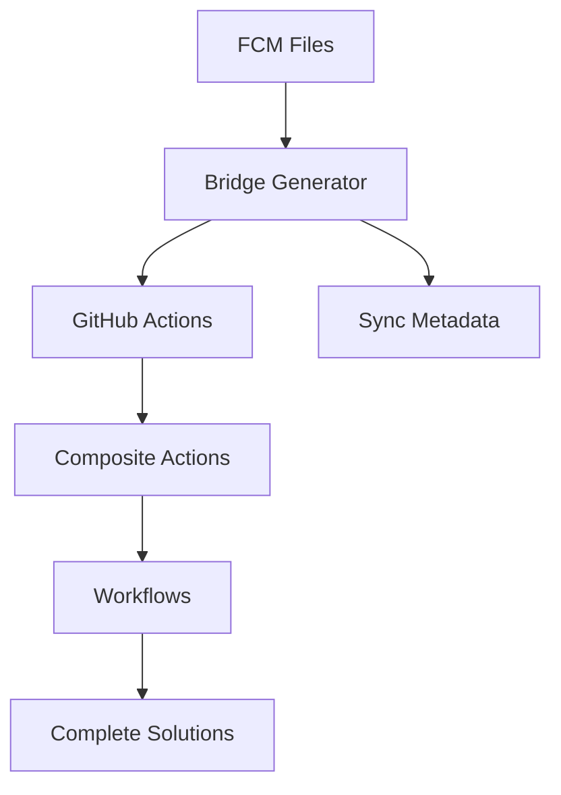
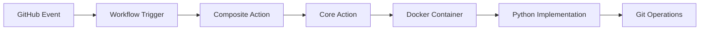
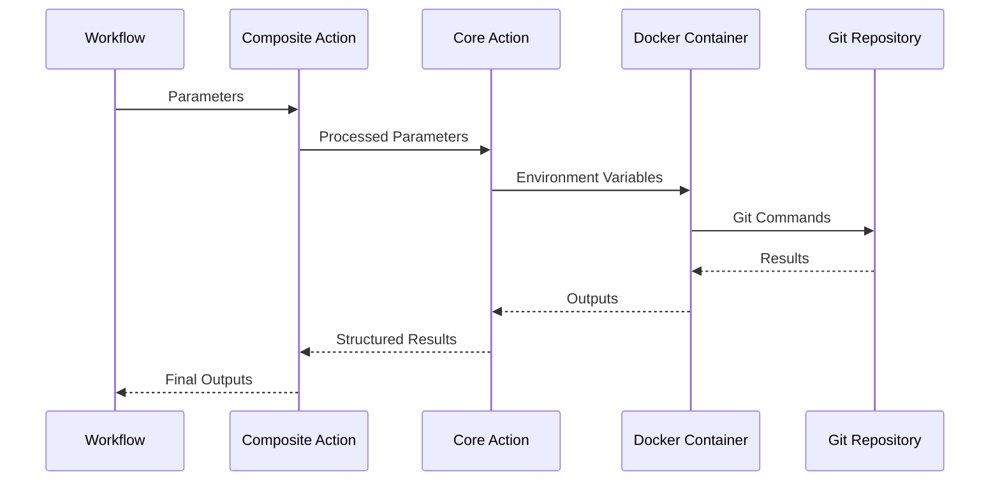

# Architecture

The GitHub Toolkit is built on a sophisticated architecture that enables scalable, maintainable, and reliable automation. This section provides deep technical insights into the architectural decisions, patterns, and implementations that power the toolkit.

## Architectural Overview

The toolkit employs several key architectural patterns:

- **[Six-Layer Architecture](../concepts/six-layers.md)** - Hierarchical organization from axioms to ecosystems
- **[FCM Bridge System](../concepts/fcm-bridge.md)** - Source-code approach to capability definition
- **[Meta-Level Design](meta-level.md)** - Self-describing and self-modifying system characteristics

## Core Architectural Principles

### 1. Separation of Concerns
- **Capability Definition** (FCM files) separate from **Implementation** (generated actions)
- **Interface** (action.yml) separate from **Logic** (main.py)
- **Configuration** (workflow files) separate from **Execution** (runtime)

### 2. Code as Data
- FCM files define capabilities as structured data
- Generated actions are compiled artifacts
- Workflows are configuration, not code

### 3. Immutable Infrastructure
- Generated components are not manually edited
- Source changes trigger regeneration
- Version control tracks both source and generated artifacts

### 4. Self-Describing Systems
- Components include metadata about their origin
- Synchronization status is trackable
- System can validate its own consistency

## Technical Architecture

### Generation Pipeline

### Runtime Architecture

### Data Flow

## Design Patterns

### 1. Bridge Pattern
- **Problem**: Manual action maintenance doesn't scale
- **Solution**: Generate actions from capability definitions
- **Implementation**: FCM → Bridge Generator → GitHub Actions

### 2. Template Method Pattern
- **Problem**: Common patterns repeated across actions
- **Solution**: LCMCP pattern provides template structure
- **Implementation**: Log → Check → Modify → Check → Push

### 3. Factory Pattern
- **Problem**: Different actions need different implementations
- **Solution**: Bridge generator creates appropriate action structure
- **Implementation**: FCM type determines generation strategy

### 4. Observer Pattern
- **Problem**: Need to track synchronization status
- **Solution**: Sync metadata observes FCM changes
- **Implementation**: Checksums and timestamps track changes

## Quality Attributes

### Scalability
- **Horizontal**: Add new domains without affecting existing ones
- **Vertical**: Add complexity at appropriate architectural layers
- **Temporal**: Handle increasing automation requirements over time

### Maintainability
- **Separation**: Clear boundaries between generated and manual code
- **Traceability**: Every action traces back to its source FCM
- **Validation**: Automated checks ensure consistency

### Reliability
- **Atomic Operations**: LCMCP pattern ensures consistency
- **Error Handling**: Comprehensive error detection and recovery
- **Validation**: Multiple validation layers prevent failures

### Performance
- **Lazy Loading**: Only generate actions when FCMs change
- **Caching**: Avoid regeneration when possible
- **Parallelization**: Independent actions can be generated concurrently

## Implementation Details

### FCM Processing
1. **Parse FCM Files**: Extract structured capability definitions
2. **Validate Schema**: Ensure FCM files meet requirements
3. **Generate Templates**: Create action.yml and Dockerfile
4. **Create Metadata**: Generate .bridge-sync tracking files

### Synchronization System
1. **Checksum Calculation**: SHA256 of FCM content
2. **Timestamp Tracking**: When FCM was last modified
3. **Version Management**: Track FCM and generator versions
4. **Drift Detection**: Identify when regeneration is needed

### Validation Framework
1. **Schema Validation**: FCM files match expected structure
2. **Interface Validation**: Generated actions are valid GitHub Actions
3. **Sync Validation**: All actions have corresponding FCMs
4. **Integration Testing**: Actions work in real workflows

## Extension Points

### Adding New Domains
1. Create domain directory in `axioms/`
2. Define FCM files for domain capabilities
3. Implement domain-specific logic patterns
4. Generate and validate new actions

### Custom Generation Logic
1. Extend bridge generator for special cases
2. Add domain-specific templates
3. Implement custom validation rules
4. Update documentation and examples

### Integration Hooks
1. Pre-generation validation hooks
2. Post-generation processing hooks
3. Custom deployment pipelines
4. Monitoring and alerting integration

## Monitoring and Observability

### Metrics
- FCM file changes over time
- Generation frequency and duration
- Action usage across repositories
- Error rates and types

### Logging
- Generation process logging
- Validation result logging
- Synchronization status logging
- Usage pattern logging

### Alerting
- Failed generations
- Synchronization drift
- Validation failures
- Performance degradation

## Future Architecture

### Planned Enhancements
- **Distributed Generation**: Generate actions across multiple repositories
- **Real-time Synchronization**: Immediate updates when FCMs change
- **Advanced Analytics**: Usage patterns and optimization recommendations
- **Enhanced Validation**: Semantic validation beyond syntax checking

### Research Areas
- **AI-Assisted Generation**: Machine learning for optimization
- **Declarative Workflows**: Higher-level workflow descriptions
- **Cross-Platform Support**: Beyond GitHub Actions
- **Integration Standards**: Industry-standard automation interfaces

## Related Documentation

- **[Core Concepts](../concepts/index.md)** - Fundamental concepts and patterns
- **[User Guide](../guides/index.md)** - Practical implementation guidance
- **[Development](../development/index.md)** - Contributing to the architecture
- **[Reference](../actions/index.md)** - Complete API documentation

## Summary

The GitHub Toolkit architecture represents a novel approach to automation that treats capability definitions as source code and generated actions as compiled artifacts. This approach provides unprecedented scalability, maintainability, and reliability while maintaining the flexibility needed for real-world automation requirements.

The architecture continues to evolve based on usage patterns, performance requirements, and the growing ecosystem of automation needs across different domains and organizations.