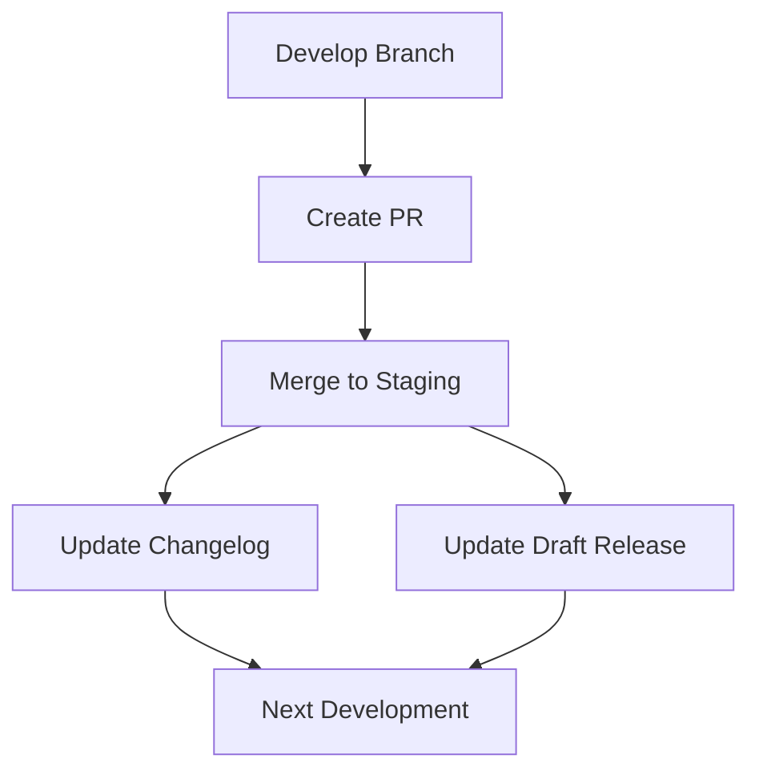
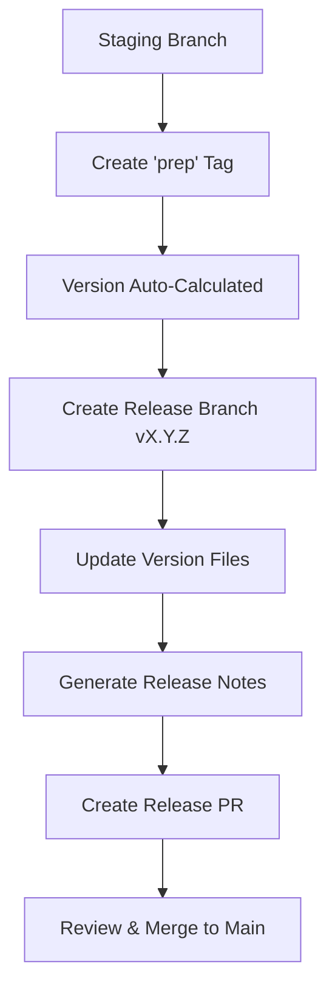
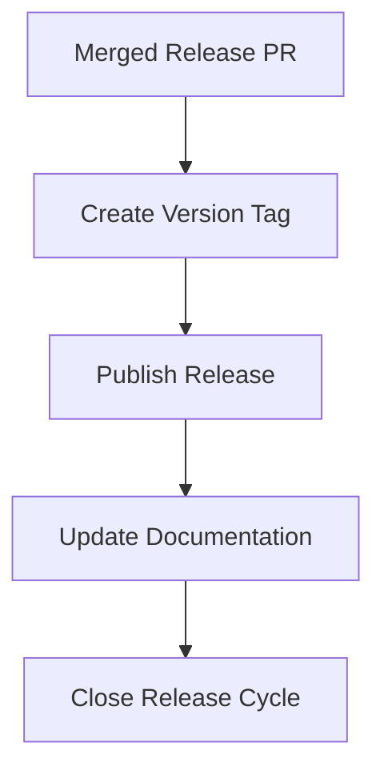
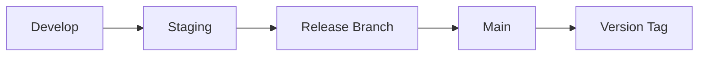

# Release Process Guide

This guide details the complete release process used across Deepworks repositories.

## Release Lifecycle

### 1. Development Phase



#### Activities

- Feature development in develop branch
- PRs created for review (develop → staging)
- Merges trigger automatic updates
- Changelog entries added
- Draft release updated

### 2. Release Preparation



#### Process (Simplified)

1. Create prep tag (no version needed):

   ```bash
   git tag prep
   git push origin prep
   ```

2. Automated GitHub Actions workflow:
   - **Version Calculation**: Uses commit count since last tag to determine next version
   - **Version Drift Prevention**: If already on a release branch, uses version from branch name (prevents drift from release process commits)
   - **Release Branch**: Creates `release/vX.Y.Z` automatically from staging
   - **File Updates**: Updates `mkdocs.yml` and other configured version files
   - **Changelog**: Auto-generates from PRs and commits using Release Drafter
   - **Release PR**: Creates PR with complete description and release notes

### 3. Release Publication



## Version Calculation

### Automatic Version Incrementing

- Based on semantic versioning
- Patch version = previous patch + commit count
- Example:

  ```git
  Current: v1.0.16
  3 new commits
  Next: v1.0.19
  ```

### Version Tag Format

- **Release tags**: `v1.0.0` (created after PR merge to main)
- **Prep tags**: `prep` (simple trigger, no version specified)
- **Version calculation**: Automatic based on commit count since last release tag
- **Format**: `v{major}.{minor}.{patch + commit_count}`

## Changelog Management

### Structure

```markdown
# Changelog

## **[(01/03/2025) - v1.0.16](link)**
- PR #45: Feature addition
- PR #44: Bug fix

## **01/03/2025 - Unreleased**
- PR #46: New feature
```

### Automation

1. PR merges add entries
2. Release prep converts format
3. Links added automatically
4. Dates managed by workflow

## Release Types

### Draft Releases

- Updated automatically
- Track ongoing changes
- Version calculated dynamically
- No manual intervention needed

### Prep Releases

- Created via prep tags
- Convert changelog format
- Create release branches
- Generate release PRs

### Final Releases

- Published via version tags
- Include all changes
- Link to changelog
- Permanent versions

## Release Branch Strategy

### Branch Flow



### Branch Naming

- Development: `develop` (active development)
- Pre-production: `staging` (testing/integration)
- Release: `release/v*` (preparation branches)
- Production: `main` (stable releases)

## Common Scenarios

### Regular Development

1. Work in develop branch
2. Make changes and test locally
3. Create PR (develop → staging)
4. Merge to staging for integration testing
5. Automatic updates occur

### Release Creation (Automated)

1. **Trigger**: Push `prep` tag to staging branch
2. **GitHub Actions**: Automatically calculates version, creates release branch, updates files
3. **Review**: Review generated release PR (release/vX.Y.Z → main)
4. **Merge**: Merge release PR to main
5. **Publish**: Version tag and GitHub release created automatically

### Hotfix Process

1. Branch from main
2. Fix issue
3. Create PR
4. Special version handling
5. Release creation

## Troubleshooting

### Version Issues

- Check tag format
- Verify commit history
- Review version calculation

### Release Problems

- Check workflow permissions
- Verify branch names
- Review workflow logs

### Changelog Issues

- Check file format
- Verify PR process
- Review automation logs

## Best Practices

1. **Version Tagging**
   - Use semantic versioning
   - Follow tag format exactly
   - Don't skip versions

2. **Changelog Entries**
   - Clear descriptions
   - Reference PR numbers
   - Keep format consistent

3. **Release Process**
   - Follow order exactly
   - Review all changes
   - Test before release

## Customization Points

### Version Calculation
- **Default Version**: `v0.1.0` (configurable in workflow)
- **Version Prefix**: `v` (can be changed to suit project needs)
- **Tag Pattern**: `v*` (filters which tags to consider for version calculation)
- **File Updates**: Configure which files get version updates (default: `mkdocs.yml`)

### Workflow Triggers
- **Prep Tag**: Currently `prep` (simple and clean)
- **Base Branch**: Default `staging` (can be overridden via workflow_call)
- **Target Branch**: Always `main` for releases

### Automation Behavior
- **Release Notes**: Auto-generated from PRs and commits
- **Changelog**: Automatically updated and formatted
- **Branch Creation**: `release/vX.Y.Z` naming convention
- **PR Templates**: Standardized release PR descriptions

### Repository-Specific Configuration
```yaml
# In repository's workflow file
uses: deepworks-net/github.toolkit/workflows/prepare-release.yml@v1
with:
  base-branch: 'staging'  # or 'develop' for different flow
  files: 'package.json mkdocs.yml VERSION'  # files to update
```

## Integration Points

### GitHub Actions

- **Version Calculator**: Core logic for semantic versioning
- **Release Notes Generator**: PR and commit aggregation
- **Git Operations**: Branch creation, file updates, PR creation
- **Changelog Updater**: Automated formatting and linking

### Repository Settings

- **Branch Protection**: Prevent direct pushes to main/staging
- **Required Reviews**: Ensure release PRs are reviewed
- **Status Checks**: Run tests before allowing merges
- **Release Permissions**: Control who can trigger releases

### Documentation

- **Version Synchronization**: Keep docs in sync with releases
- **Release Notes**: Auto-linked from changelogs
- **Deployment Triggers**: Releases trigger documentation builds
