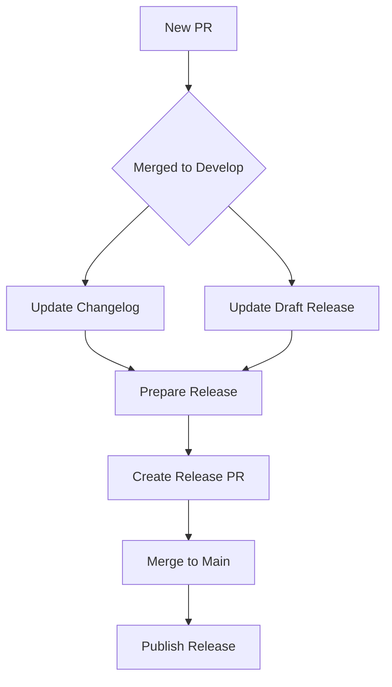

# Getting Started with Deepworks Actions

This guide will help you understand and implement Deepworks GitHub Actions workflows in your repositories.

## Overview

Deepworks Actions provide a suite of reusable workflows for:

- Documentation management with MkDocs
- Release management and versioning
- Changelog automation
- Repository standardization

## Core Workflows

### MkDocs GitHub Pages

Handles documentation deployment:

```yaml
name: Documentation
jobs:
  docs:
    uses: deepworks-net/github.actions/.github/workflows/mkdocs-gh-pages.yml@main
```

### Release Management

Manages releases and versioning:

```yaml
name: Release
jobs:
  release:
    uses: deepworks-net/github.actions/.github/workflows/release-drafter.yml@main
```

### Changelog Updates

Automates changelog maintenance:

```yaml
name: Changelog
jobs:
  changelog:
    uses: deepworks-net/github.actions/.github/workflows/update-changelog.yml@main
```

## Workflow Integration Map



## Setup Instructions

1. **Repository Configuration**

   ```yaml
   # .github/workflows/docs.yml
   name: Documentation
   on:
     push:
       branches:
         - main
   
   jobs:
     docs:
       uses: deepworks-net/github.actions/.github/workflows/mkdocs-gh-pages.yml@main
   ```

2. **Required Files**
   - `mkdocs.yml` for documentation
   - `CHANGELOG.md` for release notes
   - `.github/release-drafter.yml` for release configuration

3. **Repository Settings**
   - Enable GitHub Pages
   - Set appropriate branch protections
   - Configure required status checks

## Basic Usage

### Documentation Updates

1. Make changes to docs
2. Push to main
3. Workflow automatically deploys

### Release Process

1. Create changes in feature branch
2. Merge PR to develop
3. Changelog updates automatically
4. Draft release updates
5. Prepare release when ready
6. Merge release PR
7. Final release publishes

## Advanced Configuration

### Custom MkDocs Settings

```yaml
jobs:
  docs:
    uses: deepworks-net/github.actions/.github/workflows/mkdocs-gh-pages.yml@main
    with:
      python-version: '3.11'
      requirements-file: 'docs/requirements.txt'
```

### Release Configuration

```yaml
jobs:
  release:
    uses: deepworks-net/github.actions/.github/workflows/release-drafter.yml@main
    with:
      tag-name: 'v1.0.0'
```

## Next Steps

- Review the [Release Process Guide](release-process.md)
- Check [Configuration Guide](configuration.md)
- See [Development Guide](development.md)
- Browse [Examples](examples/index.md)

## Common Issues

1. **Documentation Not Deploying**
   - Check GitHub Pages settings
   - Verify mkdocs.yml configuration
   - Review workflow permissions

2. **Release Draft Not Updating**
   - Check release-drafter.yml configuration
   - Verify branch names
   - Review GitHub token permissions

3. **Changelog Not Updating**
   - Ensure PR merged to correct branch
   - Check file paths
   - Verify workflow permissions

## Getting Help

- Open an issue on GitHub
- Check existing documentation
- Review workflow run logs