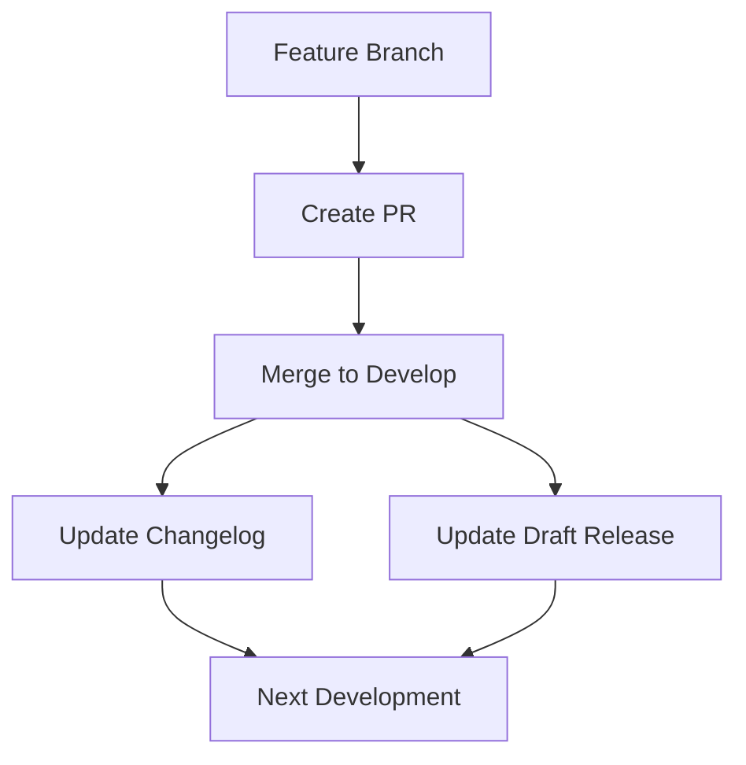
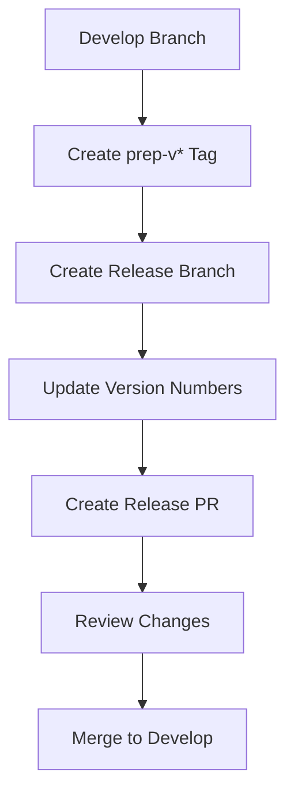
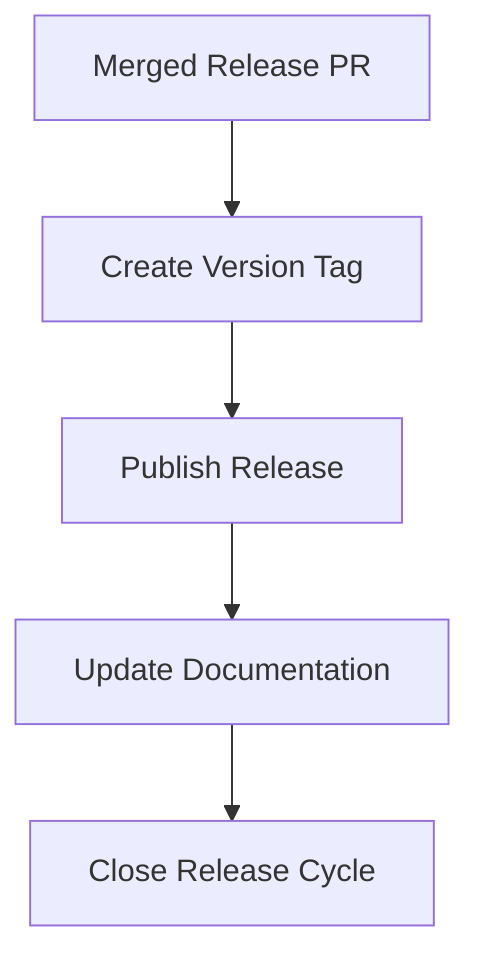
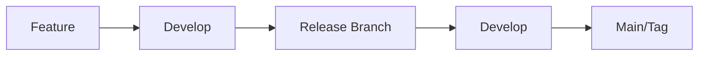

# Release Process Guide

This guide details the complete release process used across Deepworks repositories.

## Release Lifecycle

### 1. Development Phase



#### Activities

- Feature development in branches
- PRs created for review
- Merges trigger automatic updates
- Changelog entries added
- Draft release updated

### 2. Release Preparation



#### Process

1. Create prep tag:

   ```bash
   git tag prep-v1.0.0
   git push origin prep-v1.0.0
   ```

2. Automated actions:
   - Release branch created
   - Changelog updated
   - Version numbers updated
   - Release PR created

### 3. Release Publication



## Version Calculation

### Automatic Version Incrementing

- Based on semantic versioning
- Patch version = previous patch + commit count
- Example:

  ```git
  Current: v1.0.16
  3 new commits
  Next: v1.0.19
  ```

### Version Tag Format

- Release tags: `v1.0.0`
- Prep tags: `prep-v1.0.0`
- Development: calculated automatically

## Changelog Management

### Structure

```markdown
# Changelog

## **[(01/03/2025) - v1.0.16](link)**
- PR #45: Feature addition
- PR #44: Bug fix

## **01/03/2025 - Unreleased**
- PR #46: New feature
```

### Automation

1. PR merges add entries
2. Release prep converts format
3. Links added automatically
4. Dates managed by workflow

## Release Types

### Draft Releases

- Updated automatically
- Track ongoing changes
- Version calculated dynamically
- No manual intervention needed

### Prep Releases

- Created via prep tags
- Convert changelog format
- Create release branches
- Generate release PRs

### Final Releases

- Published via version tags
- Include all changes
- Link to changelog
- Permanent versions

## Release Branch Strategy

### Branch Flow



### Branch Naming

- Feature: `feature/*`
- Release: `release/v*`
- Main: `main`
- Develop: `develop`

## Common Scenarios

### Regular Development

1. Create feature branch
2. Make changes
3. Create PR
4. Merge to develop
5. Automatic updates occur

### Release Creation

1. Create prep tag
2. Review release PR
3. Merge release PR
4. Create version tag
5. Release publishes

### Hotfix Process

1. Branch from main
2. Fix issue
3. Create PR
4. Special version handling
5. Release creation

## Troubleshooting

### Version Issues

- Check tag format
- Verify commit history
- Review version calculation

### Release Problems

- Check workflow permissions
- Verify branch names
- Review workflow logs

### Changelog Issues

- Check file format
- Verify PR process
- Review automation logs

## Best Practices

1. **Version Tagging**
   - Use semantic versioning
   - Follow tag format exactly
   - Don't skip versions

2. **Changelog Entries**
   - Clear descriptions
   - Reference PR numbers
   - Keep format consistent

3. **Release Process**
   - Follow order exactly
   - Review all changes
   - Test before release

## Integration Points

### GitHub Actions

- Release Drafter
- Changelog Updater
- MkDocs Publisher

### Repository Settings

- Branch protection
- Required reviews
- Status checks

### Documentation

- Version updates
- Release notes
- Changelog links
