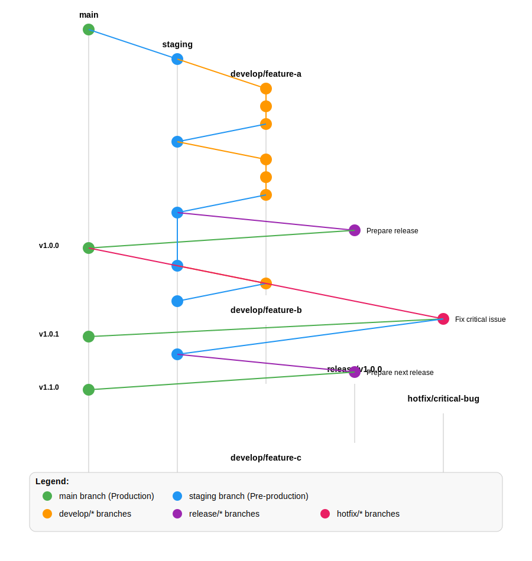

# Git Branching Strategy

This document outlines the Git branching strategy used across our projects. This approach is designed to support both continuous integration and structured releases while maintaining a clear, predictable workflow.

## Visual Overview



## Core Branches

Our workflow revolves around five types of branches, each with a specific purpose:

### 1. `main` (Production)

- **Purpose**: Represents the production-ready state
- **Protection**: Locked down - no direct commits allowed
- **Creation**: Initial repository setup only
- **Lifetime**: Permanent
- **Merges From**: Only `release/*` and `hotfix/*` branches
- **Naming**: Always `main`

### 2. `staging` (Pre-production)

- **Purpose**: Integration branch for all development work
- **Protection**: Limited - requires PR review
- **Creation**: Initial repository setup only
- **Lifetime**: Permanent
- **Merges From**: `develop/*` branches, `hotfix/*` branches
- **Naming**: Always `staging`

### 3. `develop/*` (Development)

- **Purpose**: Implementation of specific features, fixes, or improvements
- **Protection**: None
- **Creation**: Branch from `staging`
- **Lifetime**: Temporary - deleted after merging
- **Merges To**: `staging` via pull request
- **Naming**: `develop/descriptive-name`

### 4. `release/*` (Release Preparation)

- **Purpose**: Prepare and finalize a specific release
- **Protection**: Limited - requires PR review
- **Creation**: Branch from `staging` when ready to release
- **Lifetime**: Temporary - deleted after merging
- **Merges To**: Both `main` and `staging`
- **Naming**: `release/vX.Y.Z` (using semantic versioning)

### 5. `hotfix/*` (Emergency Fixes)

- **Purpose**: Address critical issues in production
- **Protection**: Limited - requires PR review
- **Creation**: Branch from `main`
- **Lifetime**: Temporary - deleted after merging
- **Merges To**: Both `main` and `staging`
- **Naming**: `hotfix/brief-description`

## Workflow Process

### Development Workflow

1. Create a development branch from `staging`:
   ```bash
   git checkout staging
   git pull
   git checkout -b develop/my-feature
   ```

2. Implement changes, committing regularly:
   ```bash
   git add .
   git commit -m "Descriptive message"
   ```

3. Push branch to remote:
   ```bash
   git push -u origin develop/my-feature
   ```

4. Create pull request to merge into `staging`
5. After review and approval, merge the PR
6. Delete the development branch when no longer needed

### Release Workflow

1. Create a release branch from `staging`:
   ```bash
   git checkout staging
   git pull
   git checkout -b release/v1.0.0
   ```

2. Make any final adjustments and version updates:
   ```bash
   # Update version numbers in relevant files
   git add .
   git commit -m "Prepare release v1.0.0"
   ```

3. Push branch to remote:
   ```bash
   git push -u origin release/v1.0.0
   ```

4. Create pull request to merge into `main`
5. After review and approval, merge the PR
6. Tag the release on `main`:
   ```bash
   git checkout main
   git pull
   git tag -a v1.0.0 -m "Release v1.0.0"
   git push origin v1.0.0
   ```

7. Merge the release back to `staging`:
   ```bash
   git checkout staging
   git pull
   git merge --no-ff release/v1.0.0
   git push
   ```

### Hotfix Workflow

1. Create a hotfix branch from `main`:
   ```bash
   git checkout main
   git pull
   git checkout -b hotfix/critical-bug
   ```

2. Implement the fix:
   ```bash
   git add .
   git commit -m "Fix critical bug"
   ```

3. Push branch to remote:
   ```bash
   git push -u origin hotfix/critical-bug
   ```

4. Create pull request to merge into `main`
5. After review and approval, merge the PR
6. Tag the hotfix on `main`:
   ```bash
   git checkout main
   git pull
   git tag -a v1.0.1 -m "Hotfix v1.0.1"
   git push origin v1.0.1
   ```

7. Merge the hotfix back to `staging`:
   ```bash
   git checkout staging
   git pull
   git merge --no-ff hotfix/critical-bug
   git push
   ```

## Using GitFlow with GitKraken

If using GitKraken with GitFlow, the workflow is simplified:

1. Initialize GitFlow in the repository
2. Select `develop` as your `staging` branch
3. Use GitFlow buttons to:
   - Start Feature (creates `develop/*` branch)
   - Finish Feature (merges to `staging`)
   - Start Release (creates `release/*` branch)
   - Finish Release (merges to `main` and back to `staging`)
   - Start Hotfix (creates `hotfix/*` from `main`)
   - Finish Hotfix (merges to `main` and `staging`)

## Integration with CI/CD

This branching strategy integrates with our CI/CD pipelines:

- **Push to `develop/*`**: Triggers tests and code quality checks
- **PR to `staging`**: Triggers comprehensive test suite and deploys to staging environment
- **PR to `main`**: Triggers production deployment preparation
- **Tag on `main`**: Triggers production deployment

## Versioning Strategy

We follow semantic versioning (MAJOR.MINOR.PATCH):

- **MAJOR**: Incompatible API changes
- **MINOR**: New functionality in a backward-compatible manner
- **PATCH**: Backward-compatible bug fixes

Version bumps are determined by:
- Regular releases: Planned MAJOR or MINOR version increases
- Hotfixes: PATCH version increases

## Fork-Based Workflow

While the above strategy works within a single repository, many team members may prefer to use a fork-based workflow. This approach provides additional isolation and can be integrated with our branching strategy as follows:

### Setting Up a Fork

1. Fork the main repository to your personal GitHub account
2. Clone your fork locally:
   ```bash
   git clone https://github.com/your-username/repository-name.git
   ```
3. Add the original repository as an upstream remote:
   ```bash
   git remote add upstream https://github.com/organization/repository-name.git
   ```

### Development Using Forks

1. Sync your fork's `staging` branch with upstream:
   ```bash
   git checkout staging
   git fetch upstream
   git merge upstream/staging
   git push origin staging
   ```

2. Create a development branch in your fork:
   ```bash
   git checkout -b develop/my-feature
   ```

3. Implement changes, committing regularly:
   ```bash
   git add .
   git commit -m "Descriptive message"
   ```

4. Push branch to your fork:
   ```bash
   git push -u origin develop/my-feature
   ```

5. Create pull request from your fork's `develop/my-feature` branch to the upstream repository's `staging` branch

6. After the PR is merged, you can delete your feature branch and sync your fork again

### Maintainer Workflow with Forks

If you're a maintainer who reviews and merges PRs from forked repositories:

1. Review PR from contributor's fork to the main repository's `staging` branch
2. After approval, merge the PR using the GitHub interface
3. For release management, follow the same release workflow described earlier, working directly in the main repository

### Advantages of Fork-Based Workflow

- Clearer separation between personal and shared work
- Ability to experiment without affecting the main repository
- Reduced risk of accidentally pushing to protected branches
- More controlled review process through cross-repository PRs

### Synchronizing Forks

To keep your fork up-to-date with the main repository:

```bash
# Ensure you're on your local staging branch
git checkout staging

# Fetch changes from the upstream repository
git fetch upstream

# Merge changes from upstream/staging into your local staging branch
git merge upstream/staging

# Push the updated staging branch to your fork
git push origin staging
```

Perform this synchronization regularly to prevent your fork from getting too far behind.

## Best Practices

1. **Keep branches current**: Regularly pull changes from `staging` into development branches
2. **Descriptive naming**: Use clear, descriptive names for branches
3. **Clean commits**: Make focused, atomic commits with clear messages
4. **Pull requests**: Always use PRs for merging to `staging` and `main`
5. **Code reviews**: Ensure all PRs receive proper review
6. **Clean up**: Delete branches after they're merged
7. **Sync forks regularly**: Keep your fork in sync with the upstream repository
8. **Reference issues**: Link commits and PRs to relevant issues

## References

- [Semantic Versioning 2.0.0](https://semver.org/)
- [GitHub Flow](https://guides.github.com/introduction/flow/)
- [GitFlow Workflow](https://www.atlassian.com/git/tutorials/comparing-workflows/gitflow-workflow)